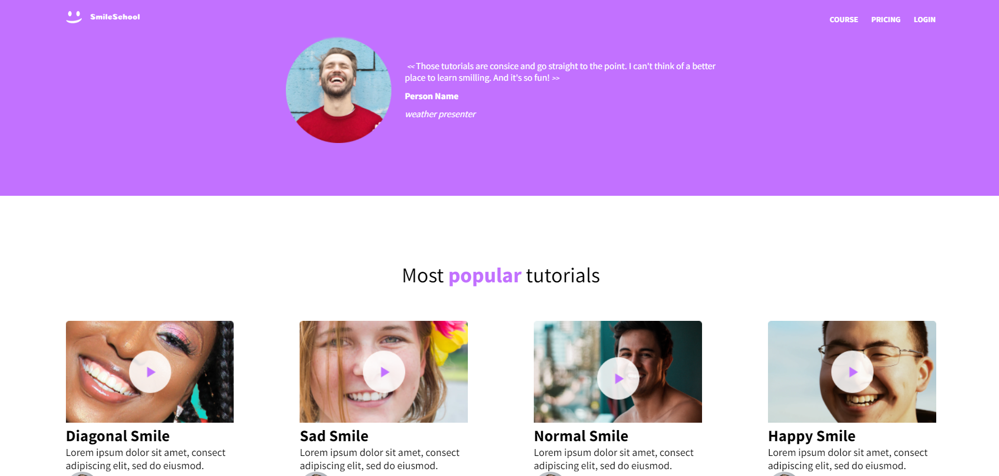
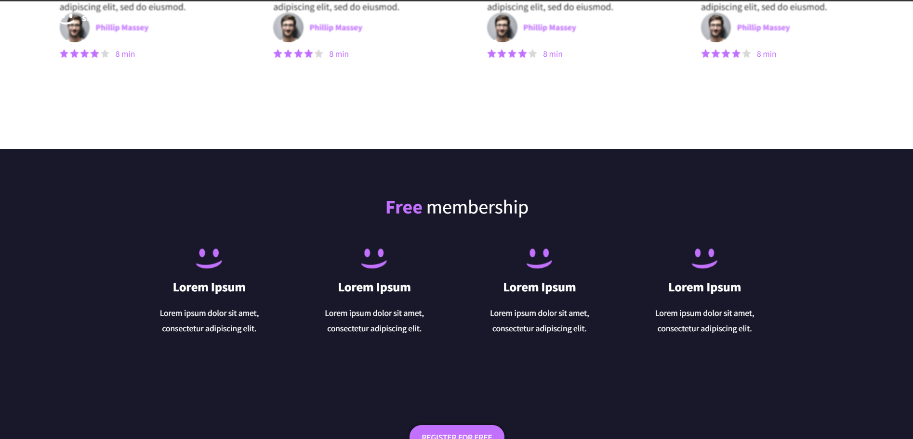
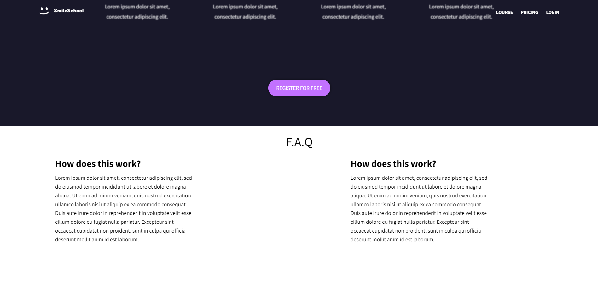

# Advanced CSS Project

## Description
This project demonstrates advanced CSS techniques to create a modern, responsive web layout. It includes features such as flexbox, gradients, and custom fonts to enhance the visual appeal and usability of the web page.

## Demo





## Downloading
1. Clone the repository:
    ```sh
    git clone https://github.com/Bonaparte003/css_advanced.git
    ```
2. Navigate to the project directory:
    ```sh
    cd advanced_css
    ```
3. Open the `index.html` file in your browser to view the project.

## Usage
- Modify the `styles.css` file to customize the styles according to your needs.
- Add your HTML content in the `index.html` file.

## Contributing
1. Fork the repository.
2. Create a new branch:
    ```sh
    git checkout -b feature/your-feature-name
    ```
3. Make your changes and commit them:
    ```sh
    git commit -m "Add your feature"
    ```
4. Push to the branch:
    ```sh
    git push origin feature/your-feature-name
    ```
5. Open a pull request.

## License
This project is licensed under the MIT License.
