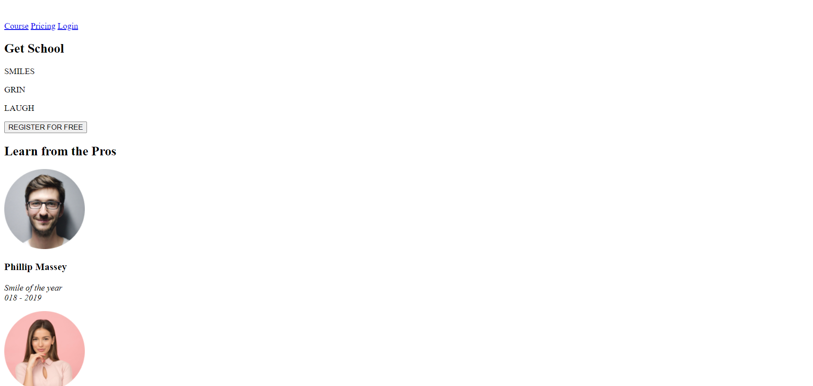
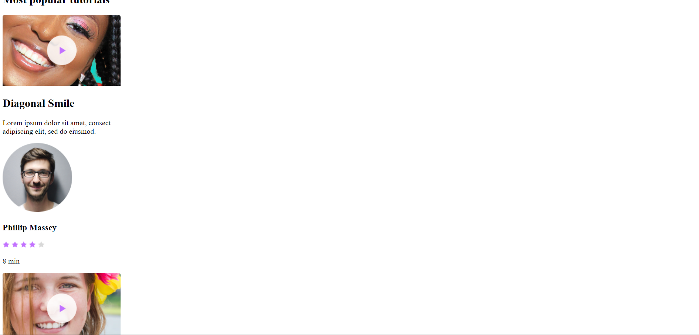
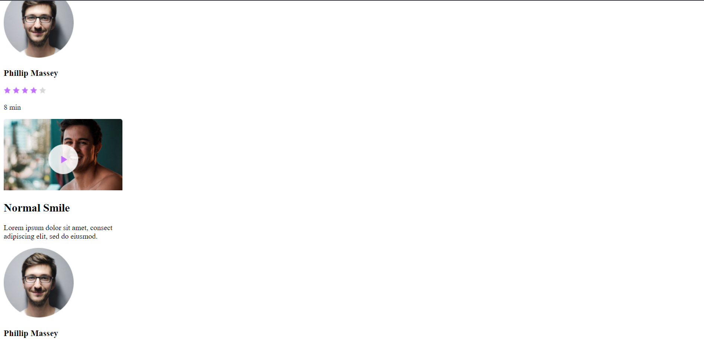
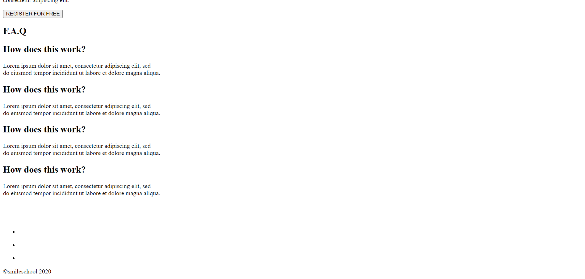

# SmileSchool Website
# A project by ALU
SmileSchool is a website for providing tutorials on different types of smiles, featuring professionals in the field of smile performance. The website offers various sections such as professional profiles, popular tutorials, testimonials, and FAQs.
## Demo

## Folder Structure
- `./images/`: Contains all the images used in the website, including avatars, logos, and stars.
- `index.html`: The main HTML file that structures the website's content.

## Technologies Used
- HTML5
- Images for avatars, stars, and logos

## How to Run the Project
1. Download or clone this repository.
2. Ensure all images are placed inside the `images` folder.
3. Open the `index.html` file in any modern browser.

## Validating HTML
To validate the HTML, you can use [W3C Markup Validator](https://validator.w3.org/). Ensure that all HTML is well-formed and free from errors or warnings.

## Known Issues
- Some stray `div` tags were flagged by the W3C validator. These issues have been corrected in the latest update.
